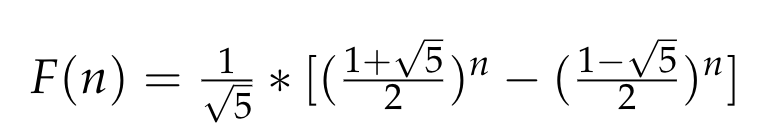

# My Daily LeetCode

This is my daily challenge to improve my skill in programming, algorithm and data structure 

Begin in Jun 6th, 2020

## Day 01:
### Jun 10th, 2020
Let's begin with easy level 
Actually, i'm not good at algorithm, so i decided to start from easy level to get more motivated

### Problem 1: Climbing Stairs
Such a classic problem
If take 1 step, there are n-1 steps left
If take 2 step, there are n-2 steps left
We notice that, f(n) = f(n-1) + f(n-2), this is the same as fibonacci number
The base solution is n=1, there is 1 step, n =2 => 2 steps

* Use recursion to solve this will take the O(2^n) complexity
* Improve this by dynamic programming, take O(N) complexity
* And in my Discrete mathematics subject, the recursion expression above can be solve 

## Day 02
### Jun 11th, 2020

### Problem 2: Remove Duplicates from Sorted List

Just browse list from head. There are 2 pointers, one is prev node, one is current node. 
If prev.val = current.val, then set the next node of prev node is the current.next

The complexity is O(N)

## Day 03

### Jun 12th, 2020

### Problem 03: Merge Sorted Array

Merge 2 array into one temp array.

Merge: compare value of each array, add the smaller value to temp array

Then copy this temp array to nums1

## Day 04

### Jun 13th, 2020

### Problem 04: Same Tree

Using recursion, and pre-order traversal
If p, q not null, compare value, if value is the same, check left child, right child. Else false
If p, q is null return true
If p, q is different each other return false;

## Day 05

### Jun 14 th, 2020

### Problem 05: Maximum Depth of Binary Tree

Using recursion, maximum is length of the longer child (left or right child)

### Jun 15th, 2020: Break :( 

 ## Day 06

 ### Jun 16th, 2020

 ### Problem 06: Minimum Depth of Binary Tree

Using recursion, minimum is length of the shorter child (left or right child).

But different from maximum, minimum length is the node that have no children.

So, use condition statement to check node is a leaf or not

 ## Day 07

 ### Jun 17th, 2020

 ### Problem 07: 136. Single Number

Using hash table

If the value not exist in hash, add this to hash table and value of this key is true, else change flag of this value to false

The value return is the key has value is true

## Day 08

### Jun 18th, 2020

### Problem 08:  Pascal's Triangle

Using array-list. Add the first row to result
Value of number from index 1..n-2 is the sum of the two numbers directly above it.
There are two list with same element, so must to remove one list (index 1 or 2) 

## Day 09

### Jun 19th, 2020

### Problem 09:  Best Time to Buy and Sell Stock

#### Way 1

Browse the whole list, get the max value of prices[j]-prices[i] (i<j)
The complexity is O(N^2)

#### Way 2

Find the smallest value and greatest in the rest of the array. The profit equal to the different between 2 values.

## Day 10

### Jun 20th, 2020

### Problem 10: Linked List Cycle

Define 2 pointers: the slow and fast pointer. 
Each loop, slow = slow.next, fast = fast.next.next
If fast is null or fast.next is null return false
If slow == fast return true.

## Day 11

### Jun 21th, 2020

### Problem 11: Rotate List

Firstly, find length of list
Value k = k % length 
Task to do is find the new tail and old tail. New tail is the k th node from tail of this list.
Now the next node of old tail is head, and new head is next node of the new tail. 

The complexity is O(N) [O(N) for find length, O(N) for find the new tail and old tail]

## Day 12

### Jun 22th, 2020

### Problem 12: Spiral matrix

Mark 4 corner of matrix, the value will follow (top-left to top-right, top-right  to bottom-right, bottom-right to bottom-left, bottom-left to top-left)

## Day 12.5

### Jun 23th, 2020

### Problem 12.5: Rotate Array

Move the k-th element from the end of array to front
Using temp array. Set value k element from end first. Set the remain value of nums array to this temp array. Copy value temp array to nums array